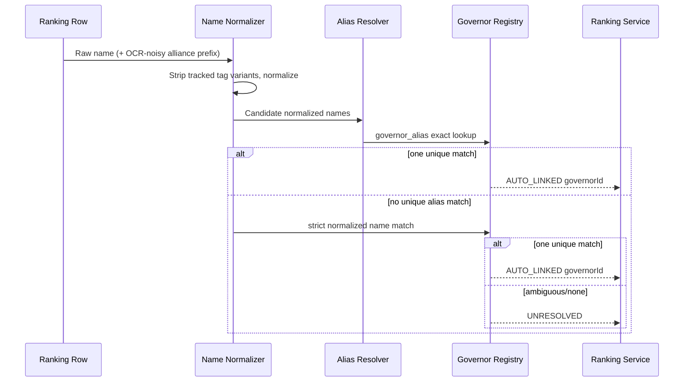

# Ranking OCR Upgrade Architecture

## End-to-end flow

```mermaid
flowchart TD
  A[Uploaded Screenshot] --> B[Dialog ROI Isolation]
  B --> C[Archetype Classifier]

  C -->|Governor Profile| D[Profile Extractor]
  C -->|Ranking Board| E[Ranking Extractor]
  C -->|Unknown| X[Fail Task: unknown-board]

  D --> D1[Profile Field OCR + Guards]
  D1 --> D2[/internal/ingestion-tasks/:id/complete profile payload]

  E --> E1[Header OCR: leaderboard type]
  E1 --> E2[Metric Header OCR + strict board/metric pairing]
  E2 --> E3[Row Segmentation + per-row Name/Metric OCR]
  E3 --> E4[Row Sanitizer + Uniformity Guard]
  E4 -->|Pass| E5[/internal/ingestion-tasks/:id/complete ranking payload]
  E4 -->|Fail| Y[Fail Task: suspicious-ranking-output]
```

## Strict identity resolution


